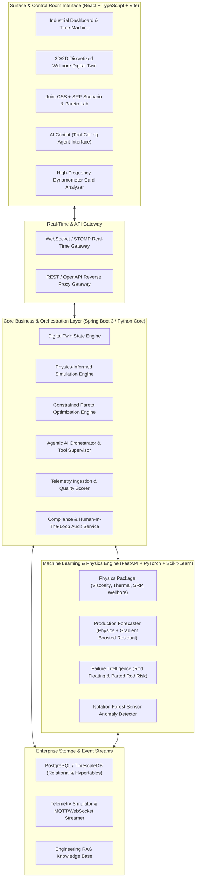

# PETRO-TWIN AI: System Architecture Specification
## SIH 2026 — Problem Statement SIH26120

---

## 1. High-Level Architectural Vision
**PETRO-TWIN AI** is architected as an industrial-grade cyber-physical decision support system. It bridges downhole reservoir thermodynamics with surface artificial lift mechanical dynamics via a microservices/modular enterprise layout:

---

## 2. Core Service Responsibilities

### 2.1 React Frontend (`/frontend`)
* Built with **React 19 / Vite / TypeScript / Tailwind CSS / Lucide / Recharts**.
* Dark industrial control room theme with ultra-high information density and sub-second reactive updates.
* Interactive **Digital Twin Time Machine** allowing timeline scrubbing across 180 days of thermal decay.
* Real-time dynamometer card rendering displaying surface vs downhole rod loading.
* **Scenario Lab** allowing side-by-side comparison of user-modified parameters against AI-recommended Pareto setpoints.

### 2.2 Python ML & Physics Microservice (`/ml-service`)
* Exposes high-performance REST APIs via **FastAPI** (`http://localhost:8000`).
* Endpoints:
  * `POST /predict/production`: Multi-horizon (t+1, t+7, t+30) production forecast with 95% confidence intervals.
  * `POST /predict/temperature`: Thermal dissipation curve and wellbore cooling rates.
  * `POST /predict/viscosity`: Temperature-dependent viscosity and Darcy oil mobility.
  * `POST /predict/failure`: Calibrated failure risks for rod floating, parted rods, and pump unseating.
  * `POST /detect/anomaly`: Multi-variate sensor anomaly detection via Isolation Forest.
  * `POST /simulate/css`: Thermodynamic CSS cycle simulation.
  * `POST /simulate/srp`: API 11L kinematics, viscous drag, and dynamometer card synthesis.
  * `POST /optimize`: Constrained multi-objective Pareto optimization (NSGA-II / Scipy SLSQP).

### 2.3 Backend Orchestration Service (`/backend`)
* Orchestrates well entity states, telemetry historical persistence, WebSocket broadcast channels, and Human-in-the-Loop approval workflows.
* Enforces strict data quality scoring (verifying timestamps, sensor drift, impossible negative loads, and units).
* Maintains an immutable **Audit Trail** for every AI-generated recommendation.

### 2.4 Agentic AI Copilot (`/agent`)
* Deterministic tool supervisor equipped with 14 domain-specific tools:
  * `get_well_state`, `get_historical_production`, `get_css_history`, `get_srp_history`, `get_current_telemetry`, `predict_production`, `predict_failure`, `predict_temperature`, `simulate_css`, `simulate_srp`, `run_scenario`, `optimize_operations`, `check_constraints`, `get_model_explanation`.
* Operates under strict guardrails: the LLM plans and calls deterministic calculation tools; it NEVER fabricates numerical constants or bypasses mechanical limits.

---

## 3. Real-Time Telemetry Flow & Data Honesty
Because live field access to Oil India's proprietary SCADA stream is legally restricted during hackathon development, the system features a **Correlated Physics-Based Telemetry Simulator**:
* Synthesizes thermodynamically correlated streams (Steam $\uparrow \implies$ Temp $\uparrow \implies$ Viscosity $\downarrow \implies$ Prod $\uparrow \implies$ Time $\implies$ Temp $\downarrow \implies$ Viscosity $\uparrow \implies$ Rod Drag $\uparrow \implies$ Rod Float Risk $\uparrow$).
* UI watermarks strictly state: `DATA MODE: SIMULATION / SYNTHETIC — NOT OIL INDIA FIELD DATA`.
* Ready-to-plug adapters (`CSVDataAdapter`, `MQTTDataAdapter`, `PostgresDataAdapter`, `RESTDataAdapter`) allow zero-code-change ingestion once field access is granted.
