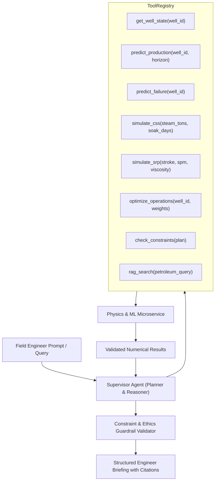

# PETRO-TWIN AI: Agentic AI Copilot Architecture
## Tool-Augmented Petroleum Engineering Supervisor, RAG Knowledge Base, and Safety Guardrails

---

### 1. Agent Architecture & Deterministic Guardrails
Unlike generic chatbots that hallucinate numbers, **PETRO-TWIN COPILOT** is architected as an industrial **Supervisor Agent** that orchestrates deterministic domain tools:

---

### 2. Available Domain Tools
1. `get_well_state(well_id)`: Fetches current thermodynamic, mechanical, and production status.
2. `get_historical_production(well_id, days)`: Queries time-series production records.
3. `get_css_history(well_id)`: Retrieves past steam injection cycles, soak intervals, and cumulative SOR.
4. `get_srp_history(well_id)`: Fetches mechanical SPM, stroke length, and rod load records.
5. `predict_production(well_id, horizon_days)`: Returns hybrid physics-ML forecast with confidence interval.
6. `predict_failure(well_id)`: Computes calibrated risks for rod floating, parted rods, and pump unsetting.
7. `simulate_css(steam_tons, soak_days)`: Runs thermodynamic Marx-Langenheim heat dissipation simulation.
8. `simulate_srp(stroke_m, spm, viscosity_cp)`: Runs API 11L kinematics and dyno card synthesis.
9. `optimize_operations(well_id, objective_weights)`: Executes constrained Pareto multi-objective optimization.
10. `check_constraints(candidate_plan)`: Validates that plan passes pressure, load, and velocity limits.
11. `get_model_explanation(model_name, prediction_id)`: Extracts SHAP feature attribution.
12. `generate_report(well_id)`: Compiles complete engineering diagnostic brief.
13. `rag_search(query)`: Grounded retrieval over Baghewala SPE literature and operational SOPs.

---

### 3. Absolute Agent Constraints
* **No Numerical Fabrication:** The agent is physically incapable of inventing production rates or pressures; all numbers originate from tool execution.
* **No Autonomous Control:** All recommended parameter modifications are presented for **Human-in-the-Loop Engineer Review** and logged to the immutable audit database.
